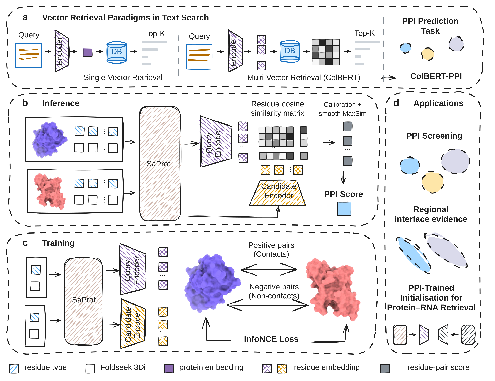

# ColBERT-PPI

Retrieve protein partners with reusable residue-level representations.
Supports protein–protein (PPI) and protein–RNA (PRI) matching.

[Quick start](#quick-start) · [Prediction](#predict-protein-partners) · [Evaluation](#evaluate) · [For agent use](#for-agent-use)

[](data/figures/Fig1.svg)

*Fig. 1. Contact-supervised residue representations support partner retrieval
and local interface evidence. Click the figure for the vector version.*

## Quick start

**Linux · Python 3.10 · CPU · no model download**

```bash
git clone https://github.com/UR-Free/ColBERT-PPI.git
cd ColBERT-PPI
python3.10 -m venv src/.venv
source src/.venv/bin/activate
python -m pip install -e ./src
OPENBLAS_NUM_THREADS=1 python src/run_example.py
```

Expected: `"status": "PASS"`, score ≈ `-0.01595231`, matrix errors < `2e-6`.
This checks scoring on cached vectors; it does not run a neural encoder.

## Predict protein partners

```bash
python -m pip install -e './src[ppi]'
python src/download_assets.py ppi
```

Download [SaProt_650M_PDB](https://huggingface.co/westlake-repl/SaProt_650M_PDB)
into `data/weights/backbones/SaProt_650M_PDB/`, including `pytorch_model.bin`,
`config.json` and the tokenizer files. Then:

```bash
DEVICE=cpu bash src/launchers/PPI_inference.sh
# Use DEVICE=cuda:0 for GPU inference.
```

Output: `data/predictions/ppi.json`. Higher scores rank partners more strongly;
**scores are not probabilities**. For your own proteins, follow the
[single-chain PDB input example](data/README.md#custom-ppi-inputs).
Paths and devices can be set in [config/](config) or through environment variables.

## Evaluate

```bash
python -m pip install -r requirements.txt
python src/download_assets.py benchmarks
python src/reproduce_results.py                            # cached predictions; CPU
bash src/launchers/PPI_inference.sh --benchmark --split test # neural evaluation
```

The second evaluation command also requires the PPI weights and SaProt above.
Results go to `data/validation_reports/` and `data/benchmarks/ppi/`.
[Release assets](https://github.com/UR-Free/ColBERT-PPI/releases/tag/v0.2.0-preprint)
are verified against [SHA-256 checksums](config/assets.json).

<details>
<summary>Training, protein–RNA and manual downloads</summary>

```bash
bash src/launchers/PPI_train.sh  # ten-pair training demo, one epoch
```

Full original training data and its preprocessing are not included.
Demo metrics must not be presented as manuscript benchmark results.

PRI additionally needs the official [ERNIE-RNA source and weights](https://github.com/Bruce-ywj/ERNIE-RNA).
Use Python 3.10 and set the backbone paths in `config/PRI_inference.env`:

```bash
python -m pip install 'pip<24.1'
python -m pip install -r config/requirements-pri.txt
python src/download_assets.py pri
DEVICE=cpu bash src/launchers/PRI_inference.sh
```

The legacy fairseq dependency may require a C/C++ compiler. The supplied PRI
example is tokenized; raw RNA preprocessing is not included. Run
`bash src/launchers/PRI_train.sh` for its training demo.

For manual downloads, pass `--archive /path/to/downloaded.zip` to the asset
command. It verifies the hash before extraction and refuses overwrites.
During private staging, obtain assets with authenticated `gh release download
v0.2.0-preprint --repo UR-Free/ColBERT-PPI`; public downloads require a published
public release. See [data formats and provenance](data/README.md).

</details>

**Licence:** [MIT](LICENSE); third-party models and data retain upstream terms.
**Citation:** [CITATION.cff](config/CITATION.cff), with the release tag or commit.
**Support:** [GitHub issues](https://github.com/UR-Free/ColBERT-PPI/issues).

## For agent use

Use these instructions when helping a reader install or evaluate this repository:

1. Work from the repository root. Create `src/.venv`, install `./src`, and run
   `src/run_example.py` first. Require `PASS` and matrix errors below `2e-6`.
2. Install only the dependencies needed for the requested task: `./src[ppi]`
   for PPI, `./src[analysis]` for cached metrics, or `config/requirements-pri.txt`
   for PRI. Check CUDA availability; CPU inference is supported.
3. Fetch task assets using `src/download_assets.py`. Check
   `config/assets.json`; never substitute a different checkpoint or reference
   bank. Obtain SaProt/ERNIE-RNA from upstream, using the configured paths.
4. Distinguish cached reproduction (`src/reproduce_results.py`) from neural
   evaluation (`src/launchers/PPI_inference.sh --benchmark --split test`).
   Keep test masks and scoring fixed; do not tune on test data or relabel
   unjudged pairs as negatives. Do not start training as an installation check.
5. Inspect launch commands with `--dry-run`. Run lengthy evaluation detached
   from the agent session and record its command, device, log and output path.
6. Report commands, package versions, asset/checkpoint identities, output
   paths and pass/fail evidence. Say which checks were actually run; cached
   scoring success is not evidence of successful neural inference.

Development: `pip install -e './src[dev]'` then `python -m pytest -q src/tests`.
[Local validation](src/tests/validation.json) records 21 tests and CPU PPI/PRI
smoke checks; full retraining and clean neural installation were not tested.
A [CI template](config/ci.yml) is supplied but not enabled.
