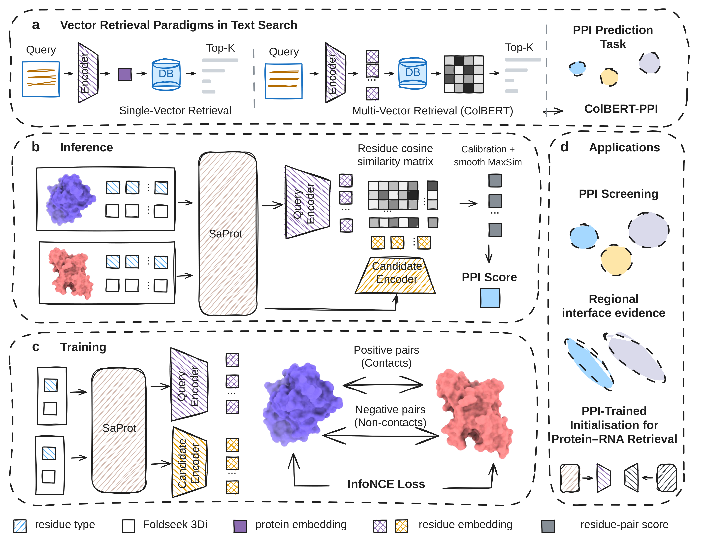

# ColBERT-PPI

Retrieve protein partners with reusable residue-level representations.
Supports protein–protein (PPI) and protein–RNA (PRI) matching.

[](data/paper/Fig1.svg)

*Contact-supervised representations for partner retrieval and interface evidence.
Click the figure for the vector version.*

## Quick start

Linux, Conda and a CUDA GPU are required for model inference.

```bash
git clone https://github.com/UR-Free/ColBERT-PPI.git
cd ColBERT-PPI
conda create -n colbert-ppi python=3.10 -y
conda activate colbert-ppi
pip install -e '.[ppi]'
colbert-ppi download ppi
```

Download [SaProt_650M_PDB](https://huggingface.co/westlake-repl/SaProt_650M_PDB)
into `data/weights/backbones/SaProt_650M_PDB/`, including its configuration,
weights and tokenizer files. Run the bundled protein-pair example:

```bash
colbert-ppi predict
```

The default device is `cuda:0`; use `CUDA_VISIBLE_DEVICES=1` to select another
GPU. Results are saved to `data/results/ppi/predictions.json`. Higher scores
indicate stronger matches; scores are not probabilities.

For your own proteins, follow the [PDB input example](data/README.md#custom-ppi-inputs), then:

```bash
colbert-ppi predict --input data/user/pairs.json
```

## Evaluate

```bash
colbert-ppi download benchmarks
colbert-ppi evaluate --task ppi --split test
```

This runs the model on GPU and saves results under `data/results/ppi/evaluation/`.
To recalculate paper metrics from the supplied predictions instead:

```bash
pip install -e '.[analysis]'
colbert-ppi reproduce
```

Only two checkpoints are distributed: **ColBERT-PPI epoch 69** and **PRI with
100% PPI initialization, seed 42, epoch 32**. The PRI checkpoint has the best
validation AUPRC among the three 100% PPI seeds. Downloads verify the
[asset checksums and model identities](data/weights/manifest.json).

<details>
<summary>Protein–RNA, training and manual downloads</summary>

PRI additionally uses the official [ERNIE-RNA source and weights](https://github.com/Bruce-ywj/ERNIE-RNA).
Set their paths in `config/pri.json`, then:

```bash
pip install 'pip<24.1'
pip install -e '.[pri]'
colbert-ppi download pri
colbert-ppi predict --task pri
```

The older fairseq dependency requires Python 3.10 and may need a C/C++ compiler.
PRI examples are tokenized; raw RNA preprocessing is not included.

`colbert-ppi train --task ppi` (or `pri`) runs a one-epoch demo on ten pairs.
Full original training data and its preprocessing are not included; demo
metrics are not manuscript benchmark results.

For an existing release ZIP, use `colbert-ppi download ppi --archive /path/to/file.zip`.
Extraction refuses to overwrite existing files. While the repository is private,
downloading requires an authorized GitHub account (`gh auth login`) or a manually
downloaded archive.

</details>

## Repository layout

```text
README.md          Start here
LICENSE            MIT
pyproject.toml     Installation and dependencies
config/            ppi.json and pri.json: model paths and run settings
src/               colbert_ppi/ implementation and tests/
data/              examples/, weights/, benchmarks/, paper/, results/
```

In `src/colbert_ppi/`, `models/` defines the encoders, `inference.py` and
`scoring.py` perform prediction, and `training.py` and `losses.py` handle
training. `cli.py` exposes the commands in `commands/`. Set defaults in
`config/`; command-line options override them. Use `colbert-ppi --help`
or append `--dry-run` to inspect a command before running it.

[Data formats](data/README.md) · [MIT license](LICENSE) ·
[Citation](data/paper/CITATION.cff) · [Issues](https://github.com/UR-Free/ColBERT-PPI/issues)

## For agent use

- Work from the repository root in the `colbert-ppi` Conda environment.
  Install `.[ppi]`, `.[pri]` or `.[analysis]` for the requested workflow.
- Check CUDA availability and select a free GPU. Model workflows default to
  GPU; report CUDA problems rather than silently switching to CPU.
- Fetch assets with `colbert-ppi download`; keep checkpoints and reference
  banks matched to `data/weights/manifest.json`. Configure backbone paths in `config/`.
- Run `colbert-ppi example` for a lightweight scoring check (expect `PASS`),
  then `colbert-ppi predict` to verify actual GPU inference. Do not start training
  as an installation check. Development checks: `pip install -e '.[dev]'` and `pytest -q`.
- Distinguish `reproduce` (saved predictions) from `evaluate` (model inference).
  Keep test masks and scoring fixed; do not tune on test data or treat unjudged pairs as negatives.
- Run lengthy jobs detached. Report the command, environment, GPU, model,
  output paths and checks actually completed. Generated files belong in `data/results/`.
